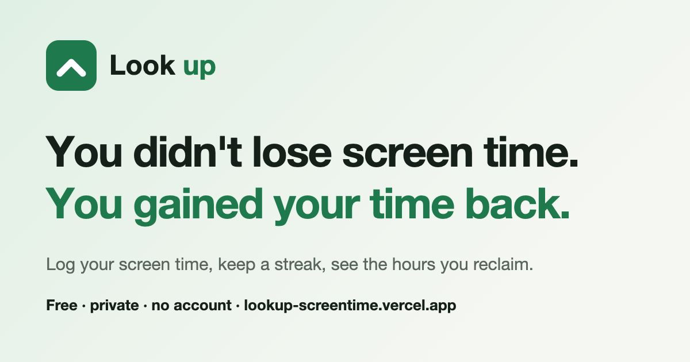

# Look Up

**Spend less of your free time on your phone, and see what you get back.**



👉 **Live:** https://lookup-screentime.vercel.app

Look Up turns the screen time number your phone already records (Screen Time on iPhone, Digital Wellbeing on Android) into a calm daily habit. Every minute under your target becomes **time reclaimed**, and it adds up.

## What it does

| Page | What's there |
|---|---|
| **Home** | Why it matters, and two sliders to see what you could get back |
| **Today** | Time reclaimed, log your day (with "what did you do instead?"), your streak, a daily phone-free challenge, a phone-down timer, a wind-down reminder |
| **Progress** | Your week, a month calendar you can edit, before → now, records, insights from your own data |
| **Rewards** | Rewards you choose for yourself ("Movie night after 3h reclaimed this week") and milestones |
| **You** | Your life in 80 dots, your targets, wind-down hours, export / import / delete your data |

## Principles

- **Free.** No paid services, no subscriptions.
- **Private.** No account, no email, no tracking or analytics. Everything stays in your browser (`localStorage`).
- **Calm.** No points, coins, levels or leaderboards, and no guilt. A day over target is just "a fresh start tomorrow".
- **Honest.** Insights only appear when there's enough data, and estimates are labelled as estimates.

## Install it like an app

Open the site on your phone, then:
- **iPhone (Safari):** Share → **Add to Home Screen**
- **Android (Chrome):** menu ⋮ → **Add to Home screen** / **Install app**

It opens full-screen with its own icon.

## How it's built

- One static page: `index.html` (HTML, CSS and vanilla JavaScript, no framework or build step).
- Fonts: Bricolage Grotesque and Atkinson Hyperlegible (Google Fonts).
- `manifest.webmanifest` and icons for installing; `og-image.png` for link previews.
- Hosted on Vercel.

### Run it locally

```bash
python3 -m http.server 8000
```

Then open http://localhost:8000. (Opening `index.html` directly also works, but some browsers block saving for files opened that way.)

## Your data

Data lives only in the browser you use. To move it to another device, use **You → Export my data**, then **Import my data** on the other device. **Delete all my data** clears everything.

Figures are estimates for motivation, not medical advice.
